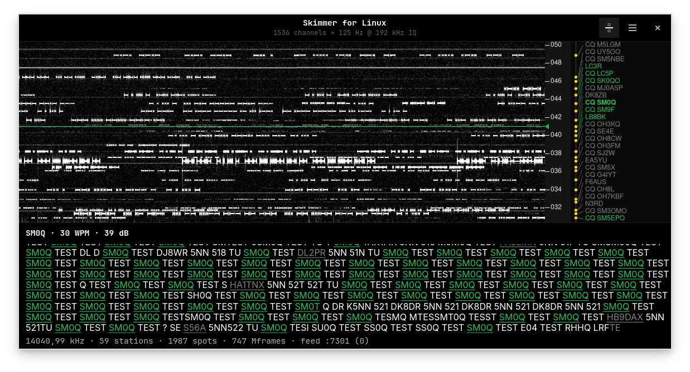

# Skimmer for Linux

**A native GTK4 multi-channel CW/RTTY skimmer for Linux — decode every signal
in a band segment at once, and spot it.** The free-software counterpart of
CW Skimmer / SDC, built as a **TCI client** for
[`sdr-for-linux`](https://github.com/OK1BR/sdr-for-linux).

It connects to an ExpertSDR-compatible **TCI server**, pulls a wideband IQ
stream straight from the radio, splits it into hundreds of narrow channels and
decodes them in parallel. Callsigns that validate are pushed back as **spots**
onto the radio's panadapter (click one to tune) and served to local loggers
over a **CW-Skimmer-dialect telnet cluster feed**.

```
sdr-for-linux (TCI server) ──IQ──► skimmer-for-linux ──► channelizer ──► CW / RTTY decode
        ▲                                                                       │
        └──────────────────────── SPOT (callsign @ freq) ◄──────────────────────┘
                                   also ──► local telnet cluster feed (loggers)
```



*Twenty metres during SAC CW: 1536 channels of 125 Hz off a 192 kHz IQ stream,
59 stations tracked and 1987 spots sent. The waterfall carries a callsign
column — a dot on each station's frequency, "CQ" where the station is calling —
and the decode pane below follows the tuned one. Callsigns that validate are
underlined; the tuned station's call is bold in the column.*

## What it does

- **Decodes the whole segment at once.** A 192 kHz IQ stream becomes 1536
  channels at 125 Hz spacing in CW, or 768 at 250 Hz in RTTY; every channel
  runs its own decoder, squelch and frequency lock.
- **CW**, with a choice of engine: the soft-decision Viterbi decoder (default)
  or the neural **DeepCW** model when an ONNX Runtime is installed. The older
  classical decoder is still in the binary, one environment variable away.
- **RTTY**, 45.45 Bd / 170 Hz shift Baudot: matched filters with automatic
  threshold correction, automatic polarity, unshift-on-space.
- **Spots to the radio.** A validated callsign goes back over TCI and appears
  on the `sdr-for-linux` panadapter; clicking it there tunes the VFO.
- **A local telnet cluster feed** in the CW Skimmer dialect, so a logger on the
  same machine sees the spots as an ordinary cluster.
- **A waterfall with a callsign column**: frequency vertical, time flowing
  sideways, a dot and a call on every tracked station, click to tune.
- **Logbook integration** with [`log-for-linux`](https://github.com/OK1BR/log-for-linux):
  stations you have already worked are spotted in gray, and clicking a call
  pre-fills the logbook's entry row.
- **The Super Check Partial call list keeps itself current** in the background.

PSK (BPSK31/63) is planned, not implemented.

The skimmer is **read-only towards the radio**: it never keys and never changes
radio state on its own. The one exception is tuning the VFO when *you* click a
callsign. The telnet feed is a local source for loggers — there is no uplink to
the RBN network.

## Requirements

- A running TCI server with an IQ stream. [`sdr-for-linux`](https://github.com/OK1BR/sdr-for-linux)
  is the tested one (Preferences → Radio → TCI). The client is written to the
  TCI specification rather than to that server's habits, so other servers
  should work in principle; one SunSDR / ExpertSDR3 run has been reported
  ([#2](https://github.com/OK1BR/skimmer-for-linux/issues/2)), which is not yet
  a supported target.
- Linux with GTK4, libadwaita, GLib/GIO, libwebsockets, libcurl ≥ 7.85 and
  FFTW (single and double precision).
- To build: `meson` and `ninja`.
- Optional, for the DeepCW engine only: an ONNX Runtime shared library. It is
  opened at run time, never linked, so the app runs without it.

## Install

Every release ships prebuilt packages on the
[Releases page](https://github.com/OK1BR/skimmer-for-linux/releases):

- **AppImage** (any current distribution, glibc 2.43+): download, `chmod +x Skimmer_for_Linux-*.AppImage`, run.
- **Ubuntu 26.04+**: `sudo apt install ./skimmer-for-linux_*.deb`
- **Fedora 44+**: `sudo dnf install ./skimmer-for-linux-*.rpm`
- **Arch Linux (AUR)** — [`skimmer-for-linux`](https://aur.archlinux.org/packages/skimmer-for-linux):
  `paru -S skimmer-for-linux`. Without a helper:
  `git clone https://aur.archlinux.org/skimmer-for-linux.git && cd skimmer-for-linux && makepkg -si`.
  The same recipe is in this repo as [`packaging/PKGBUILD`](packaging/PKGBUILD).

The newest release is **0.5.1**.

## Build from source

```sh
meson setup build
meson compile -C build
meson test -C build             # 14 offline gates, no radio needed
./build/skimmer-for-linux
```

To install into your user prefix, with the desktop entry, icon and AppStream
metainfo, so the app appears in the app grid:

```sh
meson setup builddir --prefix=$HOME/.local
meson compile -C builddir
meson install -C builddir
```

`skimmer-for-linux --version` prints the version and exits.

## Connecting to the radio

Start the TCI server first, then the skimmer. Host and port go in
**Preferences → Radio** (port 40001 unless your server says otherwise) and the
toggle in the header bar connects. The IQ sample rate is radio state: the
server announces it and the skimmer follows, so a segment is as wide as the
radio's IQ stream (48, 96, 192 or 384 kHz with `sdr-for-linux`).

No radio at hand? `SKIM_IQ_FILE=<capture.cf32>` replays a recorded IQ file
through the whole pipeline at real-time pace, looping, and draws it in the
window.

## Using the window

**Waterfall** — frequency runs vertically, time flows sideways, the kHz scale
sits between the picture and the callsign column, and a marker shows where the
radio is tuned. Retuning the radio moves the marker, not the window.

| Action | Effect |
| --- | --- |
| Wheel over the waterfall | Pan up and down the band |
| Ctrl + wheel | Zoom in and out around the pointer — the signal under it stays put |
| Drag the kHz scale strip | Pan |
| Click a callsign in the column | Tune the radio to that station, fix the decode pane on it, pre-fill the logbook |
| Click a callsign in the decode pane | The same |
| Hover a callsign in the column | Tooltip: frequency, speed, SNR, how often heard, age |

A station calling CQ carries a `CQ ` prefix in the column. A call the logbook
reports as already worked — or as not scoring in the current contest — is drawn
in gray instead of green, both in the column and on the panadapter.

**Decode pane** — below the waterfall, it follows the tuned station and shows
its text as it is decoded, with the station's speed and SNR in the header.
Calls the Super Check Partial list knows are underlined green (gray once
worked), and the protocol words take a colour by their role: calling (`CQ`,
`TEST`, `QRZ`) amber, `DE` blue, the report (`5NN`, `599`, `ENN`) violet,
closing (`TU`, `73`, `K`, `BK`, `KN`, `SK`, `AR`) coral. Only whole words are
coloured, and only once the text has firmed up — a draft tail stays gray.
Preferences → Display switches the word colours off.

## Preferences

Four tabs. Everything is stored in `~/.config/skimmer-for-linux/settings.ini`;
the key for each row is given here so the file can be edited directly.

**Radio**

| Row | Key | Notes |
| --- | --- | --- |
| Host | `[tci] host` | TCI server address, default `127.0.0.1` |
| Port | `[tci] port` | 1–65535, default `40001` |

**Decoding**

| Row | Key | Notes |
| --- | --- | --- |
| Mode | `[decode] mode` | `cw` or `rtty` — the whole segment decodes as one mode; changing it reconnects |
| CW engine | `[decode] engine` | `v2` — "Classical (v2)", the soft-decision Viterbi decoder, default — or `deepcw` — "DeepCW (neural)" |
| Device | `[decode] device` | `cpu` or `cuda`, shown for DeepCW only |
| Keep MASTER.SCP current | `[scp] auto_update` | Default on; see below |
| Loaded list | — | Read-only: release and call count of the list in use |

**Spots**

| Row | Key | Notes |
| --- | --- | --- |
| CQ only | `[spots] cq_only` | Default on: only stations calling CQ are spotted, an S&P answer does not own the frequency |
| Frequency step | `[spots] round_hz` | `0` exact, or 10 / 20 / 50 / 100 Hz — snaps outgoing spots to a grid, the measured value stays exact inside the app |
| Telnet feed → Enable | `[rbn] enabled` | Default off |
| Telnet feed → Operator call | `[rbn] call` | Announced in the feed's spot lines |
| Telnet feed → Telnet port | `[rbn] port` | Default 7300 |

**Display**

| Row | Key | Notes |
| --- | --- | --- |
| Decode pane font size | `[ui] decode_font_pt` | |
| Colour protocol words | `[ui] keyword_colours` | On by default; off leaves the decode text plain, validated calls stay marked. Applies at once |
| Colour scheme | `[ui] palette` | Waterfall palette: Classic, Mono white, Mono green, Mono amber, Inferno, Turbo |

`[ui] view` remembers whether the waterfall is shown (`waterfall` or `none`).

## The telnet spot feed

Enable it in Preferences → Spots, then point a logger at the machine:

```
$ telnet localhost 7300
skimmer-for-linux telnet feed
Please enter your call: OK1BR
OK1BR-#: Hello OK1BR, spots follow.
DX de OK1BR-#:   14043.0  UN8PT        CW    20 dB   0 WPM  CQ      0928Z
DX de OK1BR-#:   14025.6  OH3KAV       CW    31 dB  35 WPM  CQ      0928Z
```

The feed is stricter than the panadapter: a callsign reaches the panadapter at
a confidence of 0.70, the feed at 0.85, and the feed always sends CQ callers
only. A station is repeated no more often than every 600 s unless it moves.
The server is app-owned, so client sessions survive a reconnect to the radio.

## Logbook integration

[`log-for-linux`](https://github.com/OK1BR/log-for-linux) answers a read-only
UDP service on `127.0.0.1:2238`. The skimmer asks it about every call it is
about to spot and colours the spot by the answer: new stations green, stations
already in the log — or invalid for the running contest — gray. Logging a QSO
recolours the call within seconds, without a re-spot.

Clicking a callsign, in the column or in the pane, sends the call to the
logbook as well, which pre-fills its entry row.

Nothing here is required: if the logbook is not running, every answer is
"unknown", every spot is green and spotting is unaffected.

## The callsign dictionary

The extractor uses the Super Check Partial list at
`~/.config/skimmer-for-linux/master.scp` as a dictionary boost — a decoded call
found in the list gains confidence.

With **Keep MASTER.SCP current** on (the default), the app asks
[supercheckpartial.com](https://www.supercheckpartial.com) in the background,
at most once a day, whether a newer list is out; it downloads only a file that
changed, checks it (checksum, call count, how much of it looks like callsigns)
and swaps it into the running dictionary without a reconnect. A missing
network, a slow server or a bad file changes nothing — the copy on disk stays
and the app carries on. Switch it off to keep a list of your own: with the
switch on, a file copied in by hand is replaced at the next check.

## The DeepCW engine

`decode_deepcw` runs the published [DeepCW](https://github.com/e04/deepcw-engine)
model (a Conformer + CTC network, AGPL-3.0-only, not part of this repository)
through ONNX Runtime. To use it:

1. Install an ONNX Runtime with a C API — on Arch, `onnxruntime` or
   `onnxruntime-cuda` for the GPU. `SKIM_ORT_LIB=<path>` points at a library
   that is not on the loader path.
2. Put the model at
   `~/.local/share/skimmer-for-linux/models/deepcw/model.onnx`.
3. Preferences → Decoding → CW engine → DeepCW. The subtitle of that row says
   whether the engine is available on this machine.

The model reads whole words a second or two behind the keying, so its text
arrives later than the classical decoder's; the uncommitted tail is shown in
gray until it firms up. Without the runtime or the model the app says so in the
log and keeps decoding with v2.

## Files

| Path | What |
| --- | --- |
| `~/.config/skimmer-for-linux/settings.ini` | All settings |
| `~/.config/skimmer-for-linux/master.scp` | Super Check Partial call list (`.state` records the update rate limits) |
| `~/.local/share/skimmer-for-linux/` | Decode logs, one file per day |
| `~/.local/share/skimmer-for-linux/models/deepcw/` | DeepCW model, if installed |

## Environment variables

Everything that matters day to day is in Preferences. These are the few
switches that are not:

| Variable | Effect |
| --- | --- |
| `SKIM_IQ_FILE=<file.cf32>` | Replay a recorded IQ file into the window instead of connecting (`SKIM_IQ_RATE`, `SKIM_IQ_CENTER` override the sidecar) |
| `SKIM_CW_V1=1` | Use the classical CW decoder |
| `SKIM_CW_ENGINE=v1\|v2\|deepcw` | Pick the CW engine for this run |
| `SKIM_TONE_SPLIT=1` | Decode two stations in one channel separately — opt-in, awaiting its live validation |
| `SKIM_TONE_FOCUS=1` | Narrow the channel filter onto a lone carrier (implies the splitter) — same status |
| `SKIM_ORT_LIB=<path>` | ONNX Runtime library for DeepCW |
| `SKIM_SCP_URL=<url>` | Take the call list from somewhere else |

## Licence

GPL-3.0-or-later. See [`LICENSE`](LICENSE).

## Author

Richard Fakenberg — **OK1BR** — [rifak.cz](https://rifak.cz)
