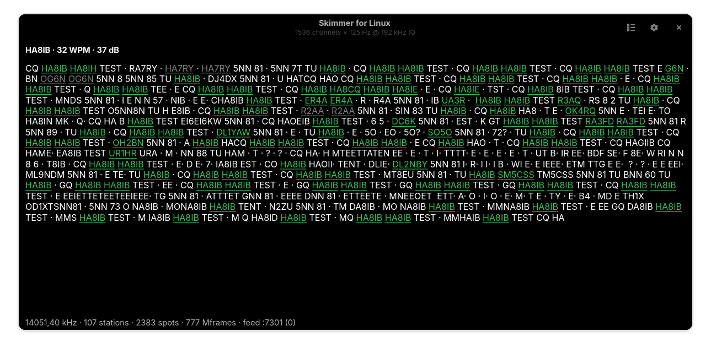

# Skimmer for Linux

**A native GTK4 multi-channel CW/RTTY/PSK skimmer for Linux — decode every
signal in a band segment at once, and spot it.** The free-software counterpart
of CW Skimmer / SDC, built as a **TCI client** for
[`sdr-for-linux`](https://github.com/OK1BR/sdr-for-linux).

`skimmer-for-linux` connects to the ExpertSDR-compatible **TCI server** in
`sdr-for-linux`, pulls a wideband IQ stream straight from the radio, splits it
into hundreds of narrow channels, and decodes them in parallel. Valid callsigns
are pushed back as **spots** onto the `sdr-for-linux` panadapter (click to
tune) and served to local loggers over a **CW-Skimmer-dialect telnet cluster
feed**.

> **Status: the skimmer skims, live.** TCI client (M1) → polyphase channelizer
> (M2: −109 dBc isolation, ~1 % of a core per 192 kHz segment) → CW decoder
> (the soft-decision Viterbi **v2**, default since 2026-08-04; the classical
> v1 stays as a fallback) → RBN-grade callsign validation
> (M4: corpus precision 1.0) → station tracker + spot feeder (M5) → local
> telnet spot feed (M6). Fresh off the bench: a per-channel **tone splitter**
> (two stations in one channel decode separately) and a **fist model** (the
> decoder learns each operator's own spacing). Everything is gated offline —
> `meson test`, 11 gates, plus a ~50× realtime replay harness for A/B runs on
> recorded off-air IQ. See [`docs/SCOPE.md`](docs/SCOPE.md) for the full plan.



*Following the tuned station at 32 WPM, 37 dB. Callsigns that validate are
highlighted — gray instead of green once the logbook says you have worked
them. The status line counts the whole segment behind it: 107 stations and
2383 spots off 1536 channels at 192 kHz.*

## How it works

```
sdr-for-linux (TCI server) ──IQ──► skimmer-for-linux ──► channelizer ──► CW/RTTY/PSK decode
        ▲                                                                        │
        └──────────────────────── SPOT (callsign @ freq) ◄───────────────────────┘
                                   also ──► local telnet cluster feed (loggers)
```

The hard half — clean, correctly-oriented wideband IQ out of the radio — already
exists and is live-verified in `sdr-for-linux` (its TCI IQ stream was tested
against SDC and CW Skimmer). This project is the decoder and the spot pipeline.

## Not just another skimmer

The interesting problems in a skimmer are not the happy path — they are QSB,
sloppy fists, crowded slots and mutated callsigns. These are the design
decisions that set this one apart, and why each was made:

### A soft-decision semi-Markov Viterbi CW decoder

Classical skimmer decoders (including our own v1, kept as a fallback) make a
**hard** mark/space decision per sample — envelope, threshold, Schmitt trigger —
and only then classify runs into dits and dahs. That pipeline has a blind spot:
**deep QSB pulls a faded element under the threshold and the evidence is gone.**
The decoder tears the callsign apart exactly where the fade sits; off-air we
watched `9A170NT` come out as a mutilated `9A1G` for minutes at a time.

The v2 decoder never makes that early decision. Every sample keeps a
**log-likelihood ratio** built from two views that fail differently:

- a **span discriminator** — where does the sample sit between the tracked
  mark and space levels? It *follows* QSB down a fade, but cannot tell a
  −18 dB notch inside a dash from a real space;
- a **noise-anchored Rayleigh term** — how plausible is the sample as pure
  noise? A notch bottoms out several times above the noise floor ("not
  noise"), a real space sits on it. Anchored, so it is blind to fading.

Their average feeds a **semi-Markov Viterbi lattice** over
{dit, dah, element/char/word space} segments with log-normal duration priors
tied to the adaptive dit clock: a faded element is *weak evidence, not no
evidence*, and the timing prior carries it through the trough. A lag-committed
traceback emits text live, with the lag itself adaptive — short on healthy
signals (half the latency), full through a fade where late evidence still
rescues drowned elements. On the recorded corpus v2 reads the true `9A170NT`
where v1 tables the mutilation, and E/T noise drops measurably; the same gate
suite runs both backends, so v1 is always one env var away (`SKIM_CW_V1=1`).

v2 has been the default since 2026-08-04, after a full contest day on the air.
The 600 s YOTA-contest replay says why: v2 tables **19** stations, v1 **12** —
and among v1's misses is the loudest signal in the segment (LZ5R, 39 dB,
673 reports for v2), while v1 mutates `SN1T` into `IN1T` and mints a phantom
`TM00TFR`. The lattice costs about 50 % more CPU (52× realtime vs 79×).

### A fist model — spacing is personal

Keying is the rigid part of a fist; **spacing is the sloppy part**. Real
operators run character gaps anywhere from 2.5 to 5+ dits and word gaps from
5 to 11 — any *fixed* char/word boundary misreads somebody. Live we caught a
station calling CQ with ~5-dit character gaps: the gap between C and Q filed
as a word space, the text read `C Q`, no CQ marker matched, and the station
was never spotted as calling.

The decoder therefore **learns each operator's own two space centres** from
the last two dozen committed gaps: 2-means in the log domain, seeded from the
ring's *quantiles* rather than the model's own labels (label-seeded learning
self-reinforces: a stretched char gap misfiled as a word space teaches the
word centre down, never the char centre up). An accepted fit moves the
duration priors, the lattice search windows and the live-emission clocks
together; forgetting the dit clock forgets the spacing with it. Converges
within one CQ call.

### A clock that jumps — QSO turnarounds

A per-mark EMA is the textbook dit tracker, and it has a textbook failure:
the **other side of a QSO comes back at their own speed**. Within the short
turnaround gap the fist memory rightly survives, so the new over rides a
stale clock — and past the 2-dit class boundary the EMA is not just slow,
it is pulled the **wrong way**: a slower op's dits classify as clean dahs,
the per-element error stays low, and the misread is self-consistent (live
on 40 m, an entire ragchew over degenerated before the watchdog caught it).

So the clock doesn't glide, it **re-locks**: a ring of recent raw mark
durations is re-clustered with the bootstrap's own splitter on every
commit, and a bimodal ring whose dit cluster leaves the ±25 % band is a
*new speed*, adopted in one jump. A dit-only stretch is genuinely
ambiguous ("EEE" at one speed *is* "TTT" at a third of it) — there the
**spaces testify**: element gaps run 1:1 with dits but 1:3 with dahs, so
the smallest space class with three consistent members settles which class
the marks are. Not the minimum (a torn dah drops glitch-length spaces
below the real gaps) and not the median (dah-heavy text holds more char
gaps than element gaps and flips it). Loose clusters never jump — that is
a ragged fist, not a speed change — and matching one-class watchdogs
(16 dahs / 24 dits) re-bootstrap the rare read that still wedges. On a
recorded 20 m QSO pair sharing one frequency, the re-lock multiplied
decoded reports from the turnaround-heavy side sevenfold.

### A tone splitter — two stations in one channel

Two stations closer than ~60 Hz land in one 125 Hz channel. Their envelopes
add, beat at Δf, and an envelope decoder mutates *both* calls — classic
crowded-contest behaviour. The splitter watches each channel's Welch-averaged
spectrum; when it resolves two or three distinct carriers ≥ 20 Hz apart it
opens a **slot per carrier** — phase-continuous NCO mix plus a narrow FIR
whose cutoff rides the live carrier spacing — and the pipeline runs a separate
decoder, callsign extractor and frequency lock per slot.

Two details matter more than the happy path:

- **Keying sidebands masquerade as carriers.** Hard 50 %-duty keying puts the
  first sideband pair only ~4 dB under the carrier — naive peak-picking would
  split every loud station against itself. Sidebands come in symmetric pairs
  about their carrier; a real second station has no mirror twin. Peaks with a
  comparable-power mirror about a stronger carrier never become slots.
- **Below ~20 Hz separation the keying spectra overlap** and no linear filter
  can part them (that is joint-demodulation / SIC territory, a possible later
  stage). Instead of pretending, the slot goes **contested**: its text still
  reaches the log and the monitor panes, but it breeds no callsign candidates
  — the beat mutations stop at the tracker instead of reaching the spot wire.

Single-carrier channels ride a sample-exact passthrough, so the feature costs
nothing until it is needed.

### One signal, one frequency

Per-decode tone estimates breathe — noise pulls band-edge estimates toward the
channel centre, and a signal midway between two overlapping channels decodes
in both. Left alone, every consumer (decode log, monitor panes, tracker,
spots) sees the wobble. Three mechanisms pin it down: **per-signal frequency
locks** (a dispatched signal locks; estimates only nudge it, a neighbouring
channel taking over *adopts* the existing lock), **cross-channel ghost
arbitration** (a +6 dB neighbour kills a splatter decode; a same-tone
tie-break stops midway signals from double-decoding), and a station tracker
that folds ghosts and clipped calls (`M0K` → `M0KKB`) before anything is
spotted.

### An RBN-grade callsign pipeline

Decoded text is not callsigns. The extractor ages its candidates **by
traffic, not by time** (a quiet channel forgets nothing), builds join
hypotheses for calls split across overs (`EA3I` + `XQ` → `EA3IXQ`) behind a
prosign/QSO-vocabulary stop-list, and tags stations as *calling* only on
explicit CQ/TEST/QRZ markers. The spot policy is CQ-only by default — an S&P
answer does not own the frequency — and the telnet feed is stricter still
(score ≥ 0.85, sparse re-spots). The hard rule inherited from the RBN world:
**no unvalidated callsign ever reaches a wire.**

### A headless engine and gates for everything

The engine is GLib-only — no GTK anywhere near DSP — so every milestone ships
an **offline gate binary**: mock TCI server round-trips, synthetic-keying
decoder suites (run for *both* CW backends), two-tone splitter fixtures, a
full offline pipeline over a real WebSocket asserting spot frequencies exact
to the Hz. Eleven gates run in `meson test`; a replay harness pushes recorded
off-air IQ through the real pipeline at ~60× realtime, which is how every
decoder change gets an A/B against yesterday's build on the same corpus
before it ships.

### Read-only against the radio

The skimmer consumes IQ and sends spots. It never keys, never changes radio
state on its own; the single deliberate exception is tuning the VFO when the
*user* activates a station row. The telnet feed is a **local** cluster source
for loggers — by decision there is no uplink to the RBN network (the only
sanctioned path is a closed Windows-only aggregator), though the dialect stays
compatible should that ever change.

## Modes

1. **CW** — shipping (the v2 Viterbi decoder is the default; the classical v1
   is one env var away, `SKIM_CW_V1=1`; tone splitter still opt-in behind
   `SKIM_TONE_SPLIT=1` / `SKIM_TONE_FOCUS=1` pending its live validation).
2. **RTTY** — shipping (45.45 Bd / 170 Hz shift Baudot: mark/space matched
   filters with ATC, automatic polarity, unshift-on-space; Preferences →
   Decoding → Mode switches the whole segment between CW and RTTY).
3. **PSK** — BPSK31/63 (Costas loop, varicode).

The channelizer is mode-agnostic and phase-preserving from day one, so each
mode is a pluggable decode backend on shared infrastructure.

## Requirements

- A running [`sdr-for-linux`](https://github.com/OK1BR/sdr-for-linux) with its
  **TCI server enabled** (Prefs → Radio → TCI), reachable over the network.
- Linux, GTK4 + libadwaita, GLib, libwebsockets, FFTW (single + double).
- Build: `meson` + `ninja`.

## Install

Pick whichever fits your distribution — every release ships prebuilt
packages on the [Releases page](https://github.com/OK1BR/skimmer-for-linux/releases):

- **AppImage** (any distro): download, `chmod +x Skimmer_for_Linux-*.AppImage`,
  run. Everything bundled, nothing to install.
- **Ubuntu 24.04+ / Debian 13+**: `sudo apt install ./skimmer-for-linux_*.deb`
- **Fedora 40+**: `sudo dnf install ./skimmer-for-linux-*.rpm`
- **Arch Linux (AUR)** —
  [`skimmer-for-linux`](https://aur.archlinux.org/packages/skimmer-for-linux):
  `paru -S skimmer-for-linux` (or `yay -S skimmer-for-linux`). Without a
  helper: `git clone https://aur.archlinux.org/skimmer-for-linux.git &&
  cd skimmer-for-linux && makepkg -si`. The same recipe lives in this repo
  as [`packaging/PKGBUILD`](packaging/PKGBUILD) — it builds the tagged
  release tarball and runs the eleven gates in `check()` before packaging.

Both distro packages are install-tested in clean containers before they are
attached to a release.

## Build from source

```sh
meson setup build
meson compile -C build
meson test -C build             # 11 offline gates, no radio needed
./build/skimmer-for-linux
```

Install into the user prefix (desktop file, icon and AppStream metainfo
included — the app shows up in the app grid):

```sh
meson setup builddir --prefix=$HOME/.local
meson compile -C builddir
meson install -C builddir
```

A plain launch runs the v2 decoder. Two switches are still opt-in until their
live validation: `SKIM_TONE_SPLIT=1` (two stations in one channel decode
separately) and `SKIM_TONE_FOCUS=1` (a narrow slot on a lone carrier; it arms
the splitter machinery too). `SKIM_CW_V1=1` falls back to the classical
decoder.

Optional: drop a `MASTER.SCP` into `~/.config/skimmer-for-linux/` and the
extractor uses it as a dictionary boost. Settings live in
`~/.config/skimmer-for-linux/settings.ini`; decode logs in
`~/.local/share/skimmer-for-linux/`.

## Relationship to sdr-for-linux

Same author (OK1BR), same house style: native GTK4/C, GPLv3, in-tree vendoring
of proven DSP (WDSP). This is a separate repo because the skimmer is a distinct
tool that talks to the radio only over TCI — it could in principle run against
any ExpertSDR-compatible TCI server.

## Licence

GPL-3.0-or-later. See [`LICENSE`](LICENSE).

## Author

Richard Fakenberg — **OK1BR** — [rifak.cz](https://rifak.cz)
